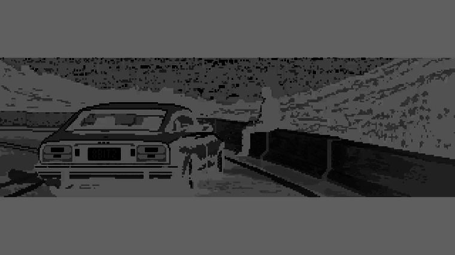

<div align="center" style="display: flex; justify-content: space-evenly; align-items: center; flex-wrap: wrap; gap: 1rem;">
	<a href="https://futfemcolombia.site" target="_blank" rel="noreferrer">
		
	</a>
	<a href="https://salsalive.vercel.app" target="_blank" rel="noreferrer">
		
	</a>
	<a href="https://luisangel.online/tools/heretics" target="_blank" rel="noreferrer">
		
	</a>
</div>

<!--START_SECTION:waka-->
📊 **This Week I Spent My Time On** 

```text
🕑︎ Time Zone: America/Bogota

💬 Programming Languages: 
TypeScript               3 hrs 14 mins       █████████████░░░░░░░░░░░░   53.32 % 
Markdown                 1 hr 38 mins        ███████░░░░░░░░░░░░░░░░░░   27.14 % 
JSON                     48 mins             ███░░░░░░░░░░░░░░░░░░░░░░   13.23 % 
CSS                      9 mins              █░░░░░░░░░░░░░░░░░░░░░░░░   02.53 % 
Python                   5 mins              ░░░░░░░░░░░░░░░░░░░░░░░░░   01.46 % 

🔥 Editors: 
Zed                      5 hrs 20 mins       ██████████████████████░░░   88.15 % 
Obsidian                 27 mins             ██░░░░░░░░░░░░░░░░░░░░░░░   07.49 % 
VS Code                  15 mins             █░░░░░░░░░░░░░░░░░░░░░░░░   04.36 % 

🐱‍💻 Projects: 
LigaF                    4 hrs 17 mins       ██████████████████░░░░░░░   70.68 % 
Unknown Project          53 mins             ████░░░░░░░░░░░░░░░░░░░░░   14.58 % 
MyPage                   37 mins             ███░░░░░░░░░░░░░░░░░░░░░░   10.23 % 
offluisangel             16 mins             █░░░░░░░░░░░░░░░░░░░░░░░░   04.52 % 

💻 Operating System: 
Windows                  6 hrs 4 mins        █████████████████████████   100.00 % 
```


<!--END_SECTION:waka-->
