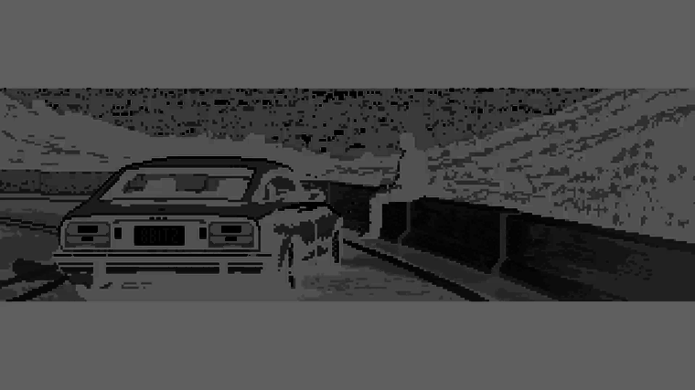

<div align="center" style="display: flex; justify-content: space-evenly; align-items: center; flex-wrap: wrap; gap: 1rem;">
	<a href="https://futfemcolombia.site" target="_blank" rel="noreferrer">
		
	</a>
	<a href="https://salsalive.vercel.app" target="_blank" rel="noreferrer">
		
	</a>
	<a href="https://luisangel.online/tools/heretics" target="_blank" rel="noreferrer">
		
	</a>
</div>

<!--START_SECTION:waka-->
📊 **This Week I Spent My Time On** 

```text
🕑︎ Time Zone: America/Bogota

💬 Programming Languages: 
Markdown                 6 hrs 30 mins       █████████████████████░░░░   84.27 % 
XML                      31 mins             ██░░░░░░░░░░░░░░░░░░░░░░░   06.85 % 
Python                   22 mins             █░░░░░░░░░░░░░░░░░░░░░░░░   04.93 % 
JSON                     6 mins              ░░░░░░░░░░░░░░░░░░░░░░░░░   01.43 % 
Other                    4 mins              ░░░░░░░░░░░░░░░░░░░░░░░░░   00.95 % 

🔥 Editors: 
Obsidian                 6 hrs 53 mins       ██████████████████████░░░   89.35 % 
Zed                      46 mins             ██░░░░░░░░░░░░░░░░░░░░░░░   09.99 % 
VS Code                  3 mins              ░░░░░░░░░░░░░░░░░░░░░░░░░   00.66 % 

🐱‍💻 Projects: 
Unknown Project          6 hrs 41 mins       ██████████████████████░░░   86.65 % 
modstawdewvalley         37 mins             ██░░░░░░░░░░░░░░░░░░░░░░░   08.20 % 
Metodos Numericos        19 mins             █░░░░░░░░░░░░░░░░░░░░░░░░   04.22 % 
LigaF                    3 mins              ░░░░░░░░░░░░░░░░░░░░░░░░░   00.66 % 
Stardew Valley           1 min               ░░░░░░░░░░░░░░░░░░░░░░░░░   00.27 % 

💻 Operating System: 
Windows                  7 hrs 43 mins       █████████████████████████   100.00 % 
```


<!--END_SECTION:waka-->
